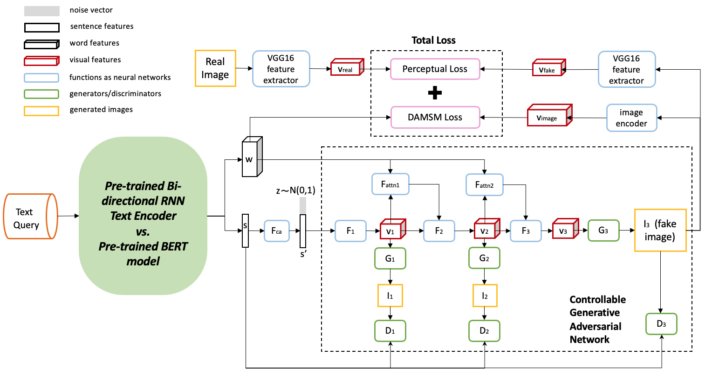

# ControlGAN with Pre Training Language Model (BERT)

### Model Architecture

This repo includes code for 2 systems:
- ControlGAN with BERT text encoder
- ControlGAN with RNN text encoder



### Requirements
- Python3
- torch
- numpy
- pandas

### Data

1. Download [CUB-200-2011 Dataset](https://deepai.org/dataset/cub-200-2011), and save into `data/birds/`

### Training

#### 1. Pretrain [DAMSM](https://github.com/taoxugit/AttnGAN) model including text encoder and image encoder
Input: bird dataset

Output: 2 trained models which are stored in `output` folder.
- text_encoder.pth
- image_encoder.pth

a. Pre-train DAMSM model for ControlGAN + BERT:
```
python pretrain_DAMSM_BERT.py --cfg cfg/DAMSM/bird_BERT.yml --gpu 0
```
b. Pre-train DAMSM model for ControlGAN + RNN: 
```
python pretrain_DAMSM.py --cfg cfg/DAMSM/bird.yml --gpu 0
```
#### 2. Train ControlGAN model 
Input: 
- text_encoder.pth (from step 1)
- bird dataset 
- `*.yml` files include configuration for training.

Output: image generator models which are stored in `output` folder.
- netG.pth

a. Train ControlGAN + BERT model:
```
python main_BERT.py --cfg cfg/train_BERT.yml --gpu 0
```
b. Train ControlGAN + RNN model: 
```
python main.py --cfg cfg/train_bird.yml --gpu 0
```

### 3. Testing
Input: 
- text_encoder.pth (from step 1)
- netG.pth
- `*.yml` files include configuration for testing.

Output: 
- New generated images for each text input (`output` or `model` folder)

** To generate images for all captions in the testing dataset, change B_VALIDATION to `True` in the eval_*.yml. 

a. Test ControlGAN + BERT model:
```
python main_BERT.py --cfg cfg/eval_BERT.yml --gpu 0
```
b. Test ControlGAN + RNN model: 
```
python main.py --cfg cfg/eval_bird.yml --gpu 0
```
### 4. Evaluation
Input: 
- New generated images folder from step 3

Output: 
- Inception Scores

** Note: we need to change the image folder path in the script.
```
python is_score.py
```
### Pretrained model
You can use these [pretrained models](https://drive.google.com/drive/u/2/folders/1p41TMRHiV-wgCu4ybwQSlScuWc2MVLW6) to reproduce the results:
- text_encoder.pth  -> Download and store in `DAMSMencoders/bird` folder
- text_encoder_BERT.pth   -> Download and store in `DAMSMencoders/bird` folder
- image_encoder.pth  -> Download and store in `DAMSMencoders/bird` folder
- image_encoder_BERT.pth  -> Download and store in `DAMSMencoders/bird` folder
- netG_RNN.pth -> Download and store in `model/bird` folder
- netG_BERT.pth -> Download and store in `model/bird` folder

### Acknowledgements
This code is developed based on [ControlGAN](https://github.com/mrlibw/ControlGAN) repository.
